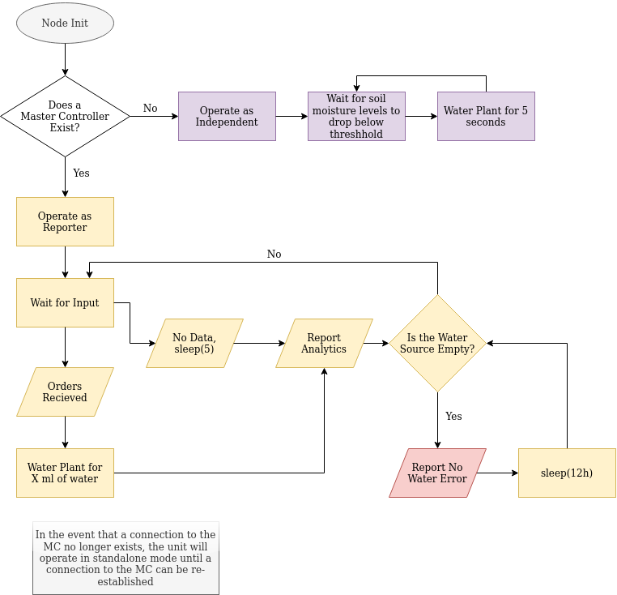
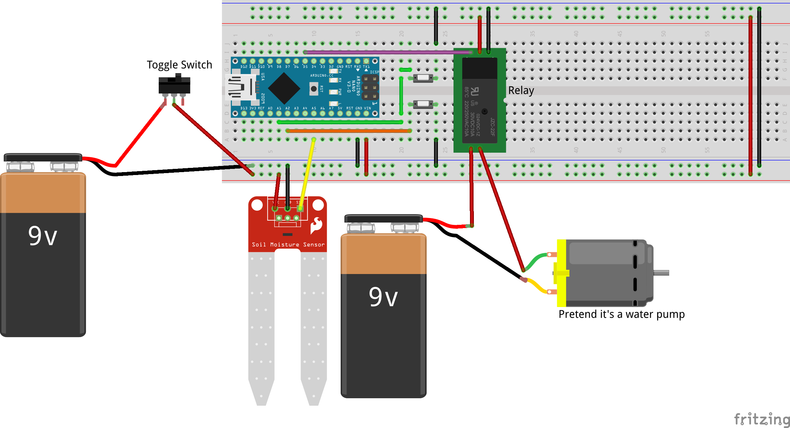

# Automated Gardener
The Automated Garden consists of a collection of nodes which will report to a master controller with analytics regarding soil temperature and soil moisture levels. Each node can be an independent system which will decide whether or not to water, or act as a reporter node which takes instructions from the mater controller.

## Node Structure
Each node will be comprised of a cheap Arduino system and will contain a micro-controller, soil moisture sensor, soil temperature monitor (if acting as a reporter node), a moisture sensor for the water source, and a solenoid pump connecting the water source to the soil. Future iterations may include a UV light. and/or a camera.

If acting as a reporter, the node activate (water/light) only when told to, and will periodically send analytics to the Master Controller's database endpoint.

If acting as an independent, the node will wait a predetermined number of minutes before dispensing a predetermined amount of water.

## Master Controller Structure
The Master Controller is a home server that will run a configuration web server as well as an Influx database. It will manage connections to garden nodes and is responsible for telling all reporter nodes when to water their plants.
Aggregated data will be reported to the end user using Chronograph or Graphana.

This phase is still in development.

## Proof of Concept Prototype

The Proof of Concept Prototype does not follow the written protocols set above. As it is a bodged kitbash project, its only purpose is to serve as a testing ground for me to experiment with and learn how to use Arduinos.

### Proof of Concept Parts List
- 12v Capable Relay (`JQC-3FF-S-Z`) (taken from kit)
- Push Button (x2)
- 3 Pin Toggle Switch
- Arduino Nano
- Capacitive Soil Moisture Sensor (taken from kit)
- 9V Battery (x2)
- 5V Water Pump (taken from kit)

Supplies from kit can be grabbed at https://www.amazon.com/gp/product/B07TLRYGT1/

You're on your own for sourcing the rest.

## Libraries

The Proof of Concept makes use of the OneButton library.